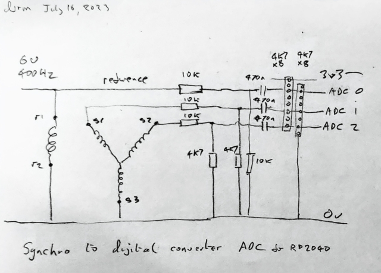
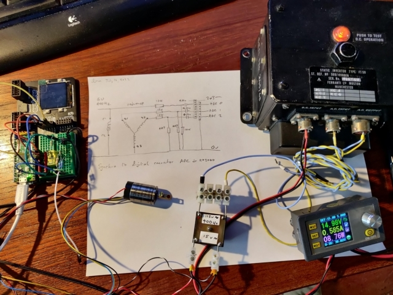

# Aviation_Synchro_Decoder
Decode angle of synchro transmitter using Arduino RP2040

##

Synchro transmitter being read by raspberry pi pico rp2040 arduino sketch with output to TFT display. Software is reading the synchro reference, and two phases of the stator. The method used for decoding is  a tracking synchro to digital converter.

## software

[rp2040 sketch](./software/pico_synchro_display/pico_synchro_display.ino)

## youtube video

[synchro angle display](https://youtube.com/shorts/Mp-xyvLs0cE)

## pictures

